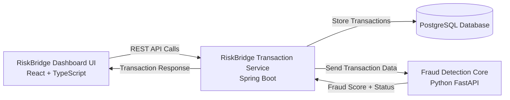
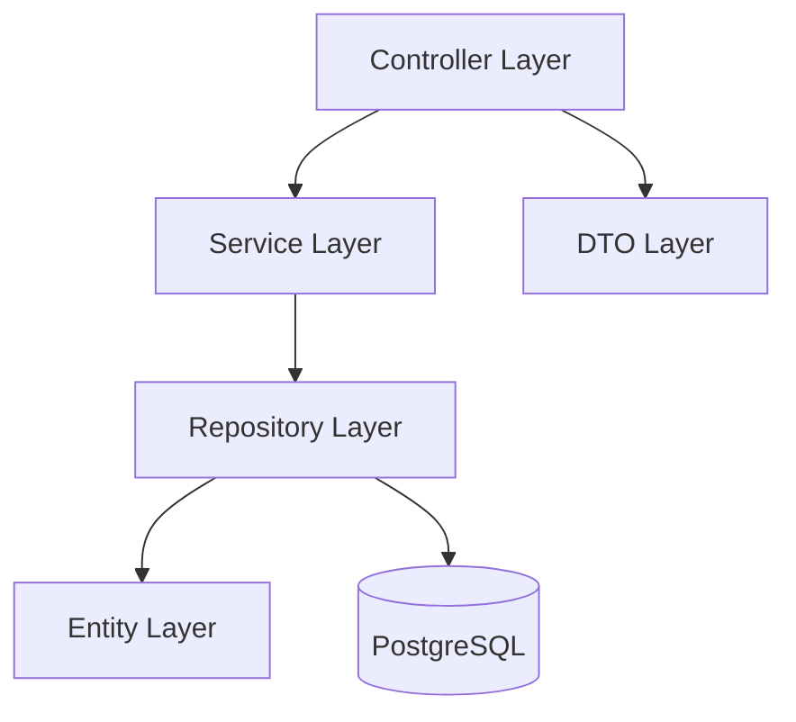

# RiskBridge Transaction Service

RiskBridge Transaction Service is the core backend system of the RiskBridge-AI platform.

This service is responsible for handling retail transactions, managing transaction data, exposing REST APIs, and coordinating fraud analysis workflows with the AI-powered fraud detection engine.

The application is designed using enterprise-grade layered architecture principles and simulates real-world fintech transaction processing systems.

---

# Tech Stack

- Java 21
- Spring Boot
- Spring Data JPA
- PostgreSQL
- Gradle
- Swagger / OpenAPI
- Docker (Planned)
- Kafka (Planned)

---

# Core Responsibilities

- Retail transaction processing
- Transaction persistence
- Fraud status tracking
- REST API exposure
- Integration with AI fraud engine
- Backend orchestration for dashboard UI

---

# System Architecture



---

# Backend Layered Architecture



---

# Project Structure

```text
riskbridge-transaction-service/
│
├── src/main/java/com/riskbridge/
│
│   ├── controller/
│   │   └── TransactionController.java
│   │
│   ├── service/
│   │   ├── TransactionService.java
│   │   └── impl/
│   │       └── TransactionServiceImpl.java
│   │
│   ├── repository/
│   │   └── TransactionRepository.java
│   │
│   ├── entity/
│   │   └── Transaction.java
│   │
│   ├── dto/
│   │   ├── TransactionRequest.java
│   │   └── TransactionResponse.java
│   │
│   ├── config/
│   │   └── SwaggerConfig.java
│   │
│   ├── exception/
│   │   ├── GlobalExceptionHandler.java
│   │   └── ResourceNotFoundException.java
│   │
│   ├── client/
│   │   └── FraudDetectionClient.java
│   │
│   ├── enums/
│   │   └── FraudStatus.java
│   │
│   └── RiskBridgeTransactionApplication.java
│
├── src/main/resources/
│   ├── application.yml
│   └── data.sql
│
├── Dockerfile
├── pom.xml
└── README.md
```

---

# Transaction Workflow

1. Retail transaction is created
2. Transaction is validated and stored
3. Fraud status is marked as `PENDING_ANALYSIS`
4. Transaction data is sent to Fraud Detection Core
5. AI engine evaluates fraud risk
6. Fraud score and status are updated
7. Dashboard UI displays transaction insights

---

# Current Features

- Transaction CRUD APIs
- PostgreSQL integration
- Layered enterprise architecture
- RESTful API design
- Swagger/OpenAPI documentation
- Fraud status management
- DTO-based request/response handling

---

# Planned Features

## AI Integration
- Python FastAPI fraud engine integration
- Real-time fraud scoring
- AI-driven anomaly detection

## Event-Driven Architecture
- Kafka event streaming
- Asynchronous transaction processing

## Scalability
- Docker containerization
- Kubernetes deployment
- Redis caching

## Security
- JWT authentication
- Role-based authorization

## Monitoring
- Centralized logging
- Application monitoring
- Metrics dashboard

---

# Example APIs

## Create Transaction

```http
POST /api/v1/transactions
```

## Get All Transactions

```http
GET /api/v1/transactions
```

## Get Transaction By ID

```http
GET /api/v1/transactions/{id}
```

## Update Fraud Status

```http
PUT /api/v1/transactions/{id}/fraud-status
```

---

# Example Transaction Request

```json
{
  "customerId": "CUST1001",
  "amount": 4500,
  "merchantName": "Retail Store",
  "country": "US"
}
```

---

# Example Transaction Response

```json
{
  "transactionId": "TXN10001",
  "fraudStatus": "SAFE",
  "riskScore": 10
}
```

---

# Future Vision

RiskBridge Transaction Service is intended to evolve into a production-style backend platform capable of supporting distributed transaction processing, AI-powered fraud analysis, and scalable enterprise integration patterns.

---

# Author

Manasa Chandra Shekar

Full Stack Developer transitioning into AI Engineering and Intelligent Systems Architecture.
